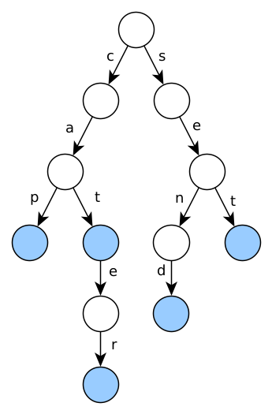
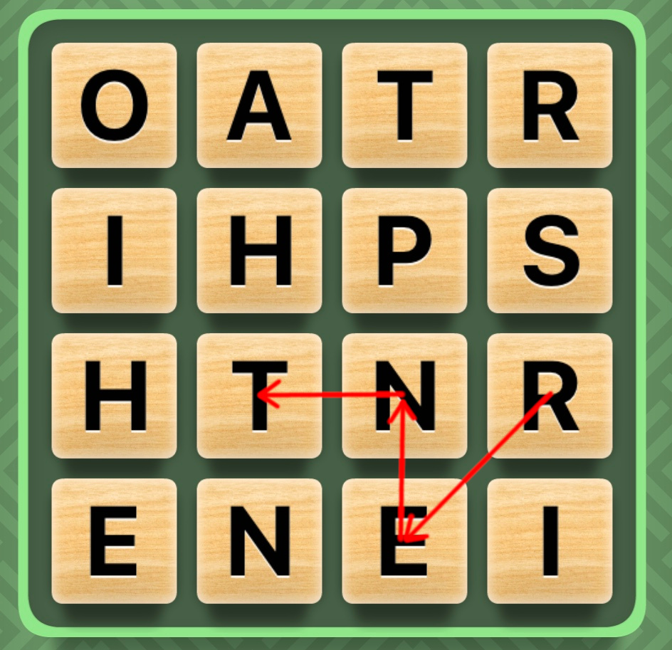

<div class='admonition caution'>
<div class='title'>Caution</div>
<div class='content'>
<ul>
<li>You are expected to work individually.</li>
<li><strong>Due: Thursday <strong>July 20st</strong> at 11pm ET (Baltimore time).</strong></li>
<li><em>This assignment is worth 60 points.</em></li>
</ul>
</div>
</div>

## Learning Objectives
<div class='admonition success'>
<div class='title'>Objectives</div>
<div class='content'>
<p>To practice with:</p>
<ul>
<li>Classes and objects</li>
<li>Constructors, destructors, assignment operators, and the rule of 3</li>
<li>Templates</li>
<li>Operator overloading</li>
<li>Trees (dynamic linked structures)</li>
<li>Recursion</li>
</ul>
</div>
</div>

## Overview

In this homework assignment, you will implement a data structure called
a *Trie* (rhymes with "try"), which is a compact and convenient way to
represent a set of sequences where many of the sequences will share
a common prefix.  One important application of tries is representing
a dictionary of words in a human language.

You will have two main tasks.  The first is to implement the
[CTrie](#the-ctrie-class) class, which is a trie representing sequences
of characters.  The second is to implement the [TTrie](#the-ttrie-class) class,
which is a generic (template) version of a trie, capable of representing
sequences of any kind of data value.

## Trees

Before we introduce tries, here is a brief introduction to trees.
You can read more about trees at the Wikipedia page:
<https://en.wikipedia.org/wiki/Tree_(data_structure)>.

Trees are similar to linked lists, but rather than each node having
a pointer to a single successor, a tree node can contain pointers to
some number of — possibly more than one — *child* nodes.  All nodes
in a tree are reachable from a *root node*, which is analogous to the
head node in a linked list.  (In fact, a linked list can be considered a
special case of a tree, where each tree node has at most one child node.)
As with a linked list, it is *usually* the case that connections from one
node to another are in one direction only. *Leaf nodes* in a tree are
the nodes which have no children.  In a tree, there is a unique *path*
(sequence of nodes) from the root to each leaf.  A data structure in
which a *cycle* (looping path) exists or where there are multiple paths
from the root to any node is not a tree.

Trees can be considered a recursive data structure because each node
in a tree can be considered to be a root.  This idea is often stated
explicitly by considering the child nodes of a parent node as being
the roots of *subtrees*.  Because of the recursive nature of trees,
it tends to be very natural to implement tree operations, such as
searches, using a recursive computation.

## Tries

For a full description of tries, you can read the Wikipedia page:
<https://en.wikipedia.org/wiki/Trie>.

A trie is a tree where each path from root to leaf represents a
sequence.  The root represents the empty sequence.  Each "hop" from a
parent node to a child represents one value in the sequence.  This
means that a path from root to an arbitrary trie node represents a
sequence of values.  Certain nodes in the trie are marked as
"endpoints".  A path from the root to an end point node represents a
sequence that is a member of the set of sequences that the trie
embodies.

Here is an example of a trie where the "hops" (links) represent letters:



A word is a sequence of letters, and the endpoint nodes in this
trie (shaded blue) represent words.  So, the trie represents the set
of words **cap**, **cat**, **cater**, **send**, and **set**.

Tries are a useful way to represent a set of words for two reasons:


* all sequences with a common prefix (**cat**, **cat**er, **cat**astrophe,
  **cat**alog, etc.) share the nodes for that prefix; this makes
  the trie space-efficient for storing sets of sequences with common
  prefixes (which is very common for words in human languages)
* determining whether a specific word is in the set is easily
  done by starting at the root and attempting to navigate a path
  corresponding to the letters in the word being checked: if it
  is possible to follow the path to an endpoint node, the word
  is in the set

## The CTrie class

The `CTrie` class represents a node in a trie where the paths
correspond to strings (sequences of character values.)

You will need to implement the following member functions and
friend functions.

`CTrie()`: Default constructor.  Creates a `CTrie` object with no children.

`CTrie(const CTrie& rhs)`: Copy constructor. Makes a deep copy of the
`CTrie` object passed as the parameter.

`~CTrie()`: Destructor.  Destroys the `CTrie` object by recursively
deleting all of its children.

`CTrie& operator=(const CTrie &rhs)`: Assignment operator. Recursively
deletes all child nodes, and then recursively copies all child nodes
of `rhs`, so that the `CTrie` object being assigned becomes an exact
duplicate of `rhs`.  (I.e., after the assignment, it should contain
exactly the same set of strings as `rhs`.)

`CTrie& operator+=(const std::string& word)`: Addition/assignment operator to
insert the sequence of characters specified by `word` into the trie.
It should return a reference to the `CTrie` object so that these
operations can be chained.

`bool operator^(const std::string &word) const`: Sequence membership test.
Returns true if `word` is a sequence of characters represented within
the trie.

`bool operator==(const CTrie& rhs) const`: Equality comparison operator.
Returns true if the trie for which `rhs` is the root, represents exactly the
same set of character sequences as the one on the left hand side of the
comparison (i.e., the "receiver object" or "implicit parameter" pointed to by `this`.)

`friend std::ostream& operator<<(std::ostream& os, const CTrie& ct)`:
Output stream insertion operator.  Outputs each sequence of characters
inserted into the trie to `os`, in lexicographical order, returning the updated `ostream`.

`unsigned numChildren() const`: Returns a count of how many children
the `CTrie` object (root) has.

`bool hasChild() const`: Returns true if the `CTrie` object has
at least one child, `false` otherwise.

`bool hasChild(char character) const`: Returns `true` if the `CTrie`
object has a link to a child node labeled with the specified `char` value.

`const CTrie* getChild(char character) const`: Returns a pointer to
the child node reachable by the link labeled with the specified `char`
value, or `nullptr` if there is no such child node.

`bool isEndpoint() const`: Returns `true` if the `CTrie` node represents
an endpoint, `false` if not.  The endpoint nodes are the ones representing
a sequence that is a member of the set the trie represents.  In a trie
represented by `CTrie` nodes, each endpoint node represents a `string` value
that is stored within the trie.

### Implementation hints

A good way of storing the links to the child nodes is to use a `map` where
the keys are `char` values and the values are `CTrie *` values.
This representation associates each child node memory address (value) with the
specific character associated with that link (key).

You will also want to have a way of marking which nodes are endpoints.
A `bool` field is a good way to do this.

You will almost certainly want to use recursion in your implementation
of the `+=` operator, the `^` operator and the `<<` operator.  

The basic idea with the `^` operator is that it is being given a `string`
containing a sequence of characters.  If the `^` operator can use each character
in the string, in order, to find links from the root to an endpoint node,
then the word is a member of the trie. (Otherwise, it isn't a member.)

The `+=` operator to insert a new word into the trie will work in a way
that is somewhat similar to the `^` operator, except that

1. It may need to add new nodes, and
2. It will need to mark the node representing the end of the word
   as an endpoint

The `<<` operator to output the entire trie to an `ostream` should
do a recursive (depth-first) traversal similar to the following pseudo-code:

```
// os is an ostream, n is a node, s is a string (sequence of characters)
output_trie(os, n, s) {
  if (n is an endpoint) {
    output s
  }

  for each child node of n, in order {
    updated_s = updated string combining s and the character linking
                to the child
    output_trie(os, child, updated_s)
  }
}
```

The idea is that the `s` parameter keeps track of the prefix represented by
the current node (`n`).


### Testing CTrie

You can compile and run the `cTrieTest` program (source code in `CTrieTest.cpp`)
to test your implementation of the `CTrie` class.  Because this program tests
most of the member functions of `CTrie`, you will probably want to start out by
adding "stub" versions of each member function.  A stub member function
implementation might look something like this:

```cpp
// addition/assignment operator
CTrie& CTrie::operator+=(const std::string& word) {
  // TODO: implement
  assert(false);
  return *this;
}
```

Note that the `cTrieTest` program is somewhat minimal.  We encourage you to
add additional tests to make sure that all of your member functions work
correctly.

**Important**: Be sure to run the `cTrieTest` program using `valgrind`.
It should run without any memory errors or memory leaks.

### The `wordHunt` program

To see a real use case of CTrie and test its functionality, we have provided 
the `wordHunt` program. This is inspired by the Word Hunt game by GamePigeon 
found in iOS devices. 

You are given a 4x4 grid of letters, and the aim of the game is to form words
on the grid. Unlike a word search grid, you are able to form words by adjoining 
any adjacent letter, though you cannot use the same letter twice. Below is a
a screenshot of the game, showing a path spelling the word "rent":



You can test your `CTrie` implementation by building this `wordHunt` program. 
The program uses the word bank `words.txt` which is prefilled with over 170k english words.

This program should incorporate the `wordHuntMain.o`, `WordSearch.o`, and
`CTrie.o` object files.  I.e., the `Makefile` rule for this program could look something like this:

```
wordHunt: wordHuntMain.o CTrie.o WordHunt.o
	$(CXX) -o wordHunt wordHuntMain.o CTrie.o WordHunt.o
```

You should add additional `Makefile` rules to compile each of these `.o` files
from the appropriate C++ source files.

When you run this program, it will load a dictionary of English words
into a trie using your `CTrie` implementation, and then solve word search
puzzles by finding paths through the letters in each puzzle that correspond
to dictionary words.  The output for the above board should look something like this:

```
( 0, 1 ) : ane and 
( 0, 2 ) : nae nah nan 
( 0, 3 ) : end enrol 
( 1, 0 ) : ort orts 
( 1, 1 ) : hand hao holt horn horned 
( 1, 2 ) : nod nor north not nos 
( 1, 3 ) : den don dona dot doth dots dos 
( 2, 0 ) : loan loaned lorn 
( 2, 1 ) : roe roan rhea 
( 2, 2 ) : rho rod rode rot rots 
( 2, 3 ) : one ode ors 
( 3, 0 ) : thro throne throned 
( 3, 2 ) : trona trone trod trode ton tonne tone toned tod 
( 3, 3 ) : son sone sod sot soth 
Total Time: 0.95307 seconds
Time taken to form Trie: 0.952531 seconds
Time taken to search Board: 0.000538 seconds
```

The left side indicates the row and column location of the starting letter. 
As you can see by the times, using a Trie is incredibly fast!

## The TTrie class

The `CTrie` class can only represent a set of sequences of `char` values.
However, tries are useful for other kinds of sequences as well.
For example, many academic libraries use the
[Library of Congress Classification](https://www.loc.gov/catdir/cpso/lcco/)
system to classify books, so that similar books can be placed together
on the shelves.  For example,
[The C++ Programming Language, 4th Edition](https://id.loc.gov/resources/instances/17655157.html)
has the classification `QA76.73.C153 S77 2013`.  Each component of the classification
has a distinct meaning: for example `Q` is the top-level classification for Science,
and `A` is the sub-category of `Q` for Mathematics.  If we break up the components
of the classification according to their meaning, we might come up with
something like `Q-A-76-73-C-153-S-77-2013`, with `-` separating each component.
Since each value in the sequence can have multiple characters, a trie containing
sequences of `string` values would be a useful way to represent a collection
of classifications.  A *generic* version of a trie data structure would be useful
for not only this example (storing sequences of strings), but other kinds of
sequences (such as sequences of integers.)

The `TTrie` class is a generic (templated) version of a trie, which is identical
to `CTrie` except that

1. The type of value in the sequences the trie contains is a type parameter
   (`DataType`)
2. A `std::vector` of `DataType` values is used to represent the member
   sequences (for the `+=` insertion operator and the `^` membership test operator)
3. When converting sequences to sequences of characters in the `<<` operator
   to output to an `ostream`, a hyphen (`-`) should be used to separate the
   values in each sequence

You should complete the implementation of the `TTrie` class by implementing each
member function and friend function in the `TTrie.inc` source file.

### Testing TTrie

As with `CTrie`, `TTrie` has an associated test program, `tTrieTest` (source code
in `TTrieTest.cpp`.)  Make sure that the tests in this test program pass.
Implementing stub versions of member functions will help in allowing the program
to compile successfully before you have every function fully implemented,
and as with `cTrieTest`, adding your own tests is a good idea.

**Important**: As with `cTrieTest`, don't forget to run `tTrieTest` using
`valgrind`.

## Files, Submitting

### Provided files

Begin by copying the starter source files, header files, and text (`.txt`) files
available in the public repo: `cs220-summer22-public/homework/hw7/`.

You will need to create a `Makefile` as follows:

* All C++ source files must be compiled with the
  `-Wall -Wextra -std=c++11 -pedantic` compiler options
  (and your code should not produce any warnings or errors when
  compiled with these options)
* We highly recommend using the `-g` compiler option to enable debugging
* `make cTrieTest` should build a `cTrieTest` executable from `CTrieTest.o` and
  `CTrie.o`
* `make tTrieTest` should build a `tTrieTest` executable from `TTrieTest.o`
  (`TTrie` is a template class, so there will be no `TTrie.o` object file)
* `make wordHunt` should build a `wordHunt` executable from
  `wordHuntMain.o`, `CTrie.o`, and `WordHunt.o`
* `make all` should build all three executables (`cTrieTest`, `tTrieTest`, and
  `wordHunt`)
* `make clean` should delete all `.o` files and executable files

### Gitlog

You must include with your submission a copy of the output of `git log`
showing at least five commits to the repository. Save the `git log` output
into a file called `gitlog.txt` (e.g. by doing `git log > gitlog.txt)`.

### README

Please submit a file called `README` (not `README.txt` or `README.md`,
etc -- just `README`) including information about what design choices you
made and anything the graders should know about your submission. In your
`README` you should:

- Write your name and JHED ID at the top of the file.
- Briefly justify the structure of your program; why you defined the functions you did, etc.
- If applicable: Highlight anything you did that was particularly clever.
- If applicable: Tell the graders if you couldn’t do everything. Where
  did you stop? What did you get stuck on? What are the parts you already
  know do not work according to the requirements?

## Compiling

Your code should compile with no errors or warnings with the typical
command: `g++ <source> -Wall -Wextra -std=c++-11 -pedantic`.

## Submission

Create a `.zip` file named `hw7.zip` containing:

- All `.cpp` files
- All `.h` files
- All `.inc` files
- README
- Makefile
- gitlog.txt

Copy `hw7.zip` file to your local machine (using `scp` or `pscp`),
and submit it as **Homework 7** on Gradescope. When you submit, gradescope
conducts a series of automatic tests. These do basic checks, e.g. to
check that you submitted the right files. If you see error messages (in
red), address them and resubmit. You may re-submit any number of times
prior to the deadline; only your latest submission will be graded. Review
the course syllabus for late submission policies (grace period and late
days), and remember that **if your final submitted code does not compile,
you will likely earn a zero score for the assignment.**

<div class='admonition danger'>
<div class='title'>Danger</div>
<div class='content'>
<p>Remember that if your final submitted code does not compile, you will earn a zero score for the assignment.</p>
</div>
</div>

<div class='admonition info'>
<div class='title'>Info</div>
<div class='content'>
<p>Two notes regarding automatic checks for programming assignments:</p>
<ul>
<li>Passing an automatic check is not itself worth points. (There might be a nominal, low point value like 0.01 associated with a check, but that won’t count in the end.) The checks exist to help you and the graders find obvious errors.</li>
<li>The automatic checks cover some of the requirements set out in the assignment, but not all. It is up to you to test your own work and ensure your programs satisfy all stated requirements. Passing all the automatic checks does not mean you have earned all the points.</li>
</ul>
</div>
</div>

