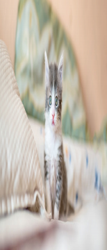

<div class='admonition caution'>
<div class='title'>Caution</div>
<div class='content'>
<ul>
<li>You are expected to work in a team of two or three.</li>
<li><strong>Due: Friday June 28th at 11pm EDT (Baltimore time).</strong></li>
</ul>
</div>
</div>

*Update*: In addition to submitting the code, each individual team member
should complete the [Individual Contributions Survey](#submission) on gradescope by 11pm
on **Sunday, June 30th**.

## General Requirements

This is a programming assignment, meaning you will write and submit the source code for a program. 

<div class='admonition danger'>
<div class='title'>Danger</div>
<div class='content'>
<p>All programs <strong>must</strong> compile (and run) on the ugrad machines using our standard compiler options.</p>
</div>
</div>

This is a team assignment of two students. You are to work with your partner(s) on this project, and should take a "paired programming" approach, where you frequently work together at a single screen and code together, in particular when you are testing and debugging your program. Remember, you are all responsible for all the code you submit. 

<div class='admonition tip'>
<div class='title'>Working remotely</div>
<div class='content'>
<p>To work remotely together, you may consider granting access control to your partners during a Zoom session so that you can work together on a shared screen to code, test and debug the program.</p>
</div>
</div>

As before, you are required to use the `git` version control system and include a *log file* (`gitlog.txt`) with your project submission.

<div class='admonition caution'>
<div class='title'>Caution</div>
<div class='content'>
<p>We will provision you a separate repo for your midterm project under <code>jhu-ip</code> organization and all team members along with course staff will be invited to have admin role on the repo.</p>
</div>
</div>

This project is larger and more complex than previous programming assignments. Additionally, since you have now been exposed to most of what C can do, there are no restrictions on what language features you can use (other than the conventions of good style, of course; you still shouldn't use global variables, for example).

<div class='admonition tip'>
<div class='title'>Tip</div>
<div class='content'>
<p>From this point forward in the semester, your programs will need to not only compile and run cleanly (i.e. with <strong>no warnings, errors, or crashes</strong>), but also not have any <strong>memory leaks</strong> (as reported by valgrind).</p>
</div>
</div>

<div class='admonition info'>
<div class='title'>Info</div>
<div class='content'>
<p>For this project, you will be working with images. This will mean that you will want to view images, which means that if you want to work remotely on the ugrad machines, you will need to set up X-tunnelling using <a href="https://sourceforge.net/projects/xming/">Xming</a> on Windows or <a href="https://www.xquartz.org/">XQuartz</a> on Mac (Reach out to us if you need help to set this up).</p>
<p>Also, PPM images can be quite large; be aware of file sizes, and try not to fill up your hard drive (or your disk quota on ugrad) with thousands of cat pictures...</p>
</div>
</div>

## Program Description
This program will be an image processing program, in the vein of Photoshop. Yours will have a command-line-based user interface (UI), so there will be no graphical interface, and the range of operations will be limited, but the algorithms you will use are the similar ones used in programs like Photoshop or GIMP.

At a basic level, your program will be able to read image files from disk, perform one of a variety of image processing tasks, and then write the result back to disk as a new image file. Since your program will not have a GUI, you will use external programs to view the images. If you are on ugrad (either locally, or remotely with X-tunnelling), you can use the program `feh`.

<div class='admonition info'>
<div class='title'>Info</div>
<div class='content'>
<p><code>feh</code> is a very simple command-line image viewer. It is available on ugrad machines and you can simply run the program with the name of an image file as a command-line argument, and it will display the image on your screen. e.g.</p>
<div class="sourceCode" id="cb1"><pre class="sourceCode sh"><code class="sourceCode bash"><a class="sourceLine" id="cb1-1" title="1">$ <span class="ex">feh</span> myimage.ppm</a></code></pre></div>
<p><strong>Note:</strong> Before running <code>feh</code>, make sure either Xming or Xquartz is running and x-tunneling is enabled (i.e. add -Y on mac when you <code>ssh</code> in to ugrad. On Putty, enable x-11 forwarding option)</p>
</div>
</div>

If you are using a different platform, you are welcome to use an image viewer of your choice; `feh` is easy to install using most linux package managers, but there are other open source image viewing programs, as well as alternatives for Windows and OSX.

While there are many formats for storing image files, your program will **only** need to read and write one, the **PPM** format. This is essentially the simplest and easiest format to read and write, which is why it was chosen; its main drawback is that it does not use any kind of compression, so images stored in this format tend to be on the large side when compared to formats like JPEG or PNG or GIF. An implmentation to read and write PPM file is provided for you. (See `ppm_io.h` and `ppm_io.c` in the starter code.)

<div class='admonition caution'>
<div class='title'>Caution</div>
<div class='content'>
<p>Make sure to do a <code>git pull</code> on the public repo before starting to work to get the starter files for this project. You must work with the starter files!</p>
</div>
</div>

Your program will be a command line tool, always run with the name of the executable file project followed by the name of an input PPM file, the name of a desired output PPM file, and the specific lower-case name of an image processing operation, as listed below. Some operations require additional arguments, which will also be supplied at the command line by the user, at the end of the line. There is no input entered by the user interactively.

<div class='admonition info'>
<div class='title'>Info</div>
<div class='content'>
<p>Regardless of the desired operation, the first two arguments after the executable name project are always interpreted as the input file name followed by the output file name. The next argument is always interpreted as the operation name, and the operation's arguments (if any) come after that.</p>
</div>
</div>

The operations your program will be able to recognize and perform are all of the following (the bolded words are the operation names to be entered at the command line by the user):

1.  [**grayscale**](#grayscale) - covert the input image to grayscale (i.e. a full-color image becames shades of gray)
2.  [**binarize**](#binarize) - convert the input image to black and white by thresholding
3.  [**crop**](#crop) - crop the input image given corner pixel locations
4.  [**transpose**](#transpose) - transpose the input image (i.e. flip it along the diagonal)
5.  [**gradient**](#gradient) - compute the gradient of an input image and save its magnitude as an image
6.  [**seam**](#seam-carving) - a simplified version of [seam carving](https://en.wikipedia.org/wiki/Seam_carving)

For example, at the command prompt, a user of your program might type:

```sh
$ ./project building.ppm building_crop.ppm crop 50 50 500 500
```

to crop the input image `building.ppm` (in PPM format) and output the cropped image to `building_crop.ppm`, where `(50, 50)` and `(500, 500)` specify the top-left and bottom-right pixel locations to crop.  Or, if the desire is to seam carve the input image by half in both dimension of the input image, then the user could run:

```sh
$ ./project trees.ppm trees_seam.ppm seam 0.5 0.5
```

to generate the output file named `trees_seam.ppm`, which is a seam carved version of `tress.ppm`.
-->

When you first begin this project, we suggest that you checkout the provided demo program `checkerboard`. You can compile the demo program by running `make checkerboard`.  An executable `checkerboard` should be generated. The program demonstrates how to use `ppm_io` to read and write PPM formated files, and also shows how the `struct Pixel` and `struct Image` are used.

<div class='admonition tip'>
<div class='title'>Tip</div>
<div class='content'>
<p>In the starter code, we also provide a helper executable `img_cmp`, which you could run on ugrad machine to compare if two PPM files are the same up to a tolerance. It's usage is:</p>
<div class="sourceCode" id="cb1"><pre class="sourceCode sh"><code class="sourceCode bash"><a class="sourceLine" id="cb1-1" title="1">$ <span class="ex">./img_cmp</span> <span class="op">&lt;</span>PPM file1<span class="op">&gt;</span> <span class="op">&lt;</span>PPM file2<span class="op">&gt;</span> [tolerance = 0]</a></code></pre></div>
<p>The program takes two PPM files with the same dimension and compare them pixel by pixel. It counts how many pairs of pixels are within the given tolerance. A pair of pixel (with same row and col indices) of two images is said within the tolerance if each absolute difference of their three channel values is less than or equal to the tolerance. For example, if you run:</p>
<div class="sourceCode" id="cb2"><pre class="sourceCode sh"><code class="sourceCode bash"><a class="sourceLine" id="cb2-1" title="1">$ <span class="ex">./img_cmp</span> checkerboard1.ppm checkerboard2.ppm 5</a></code></pre></div>
<p>it should tell you how many pair of pixels in <code>checkerboard1.ppm</code> and <code>checkerboard2.ppm</code> have an absolute difference of more than 5 (i.e. intensity difference).</p>
</div>
</div>

After you have checked the `checkerboard.c`, `ppm_io.c`, and `ppm_io.h` files, as an initial test to be sure you're on the right track, try to read in a PPM file and write it out unchanged.  Use the `img_cmp` program to verify the two files are the same. Once this works well, begin successively working through the other commands as listed.

## Development Plan
For this project, the development plan is largely in your hands. You are required to create (or modify the provided one) a Makefile and submit it for this project, and the executable it generates should be named `project`. You should also rigorously test your code, but you are not required to hand in specific tests with your submission. Beyond that, it is largely up to you how to structure your program, and what order to implement features in, but you **must take a modular approach**.

We recommend that you break your code into several files, and have as little code as possible in main(). Here is a suggested (but not required) breakdown of features into files:

- `Makefile` -  you **must** include a `Makefile` that can build your program; it's how the graders will compile your submission. You are required to build a target whose name is `project`.
- `project.c` - the main program. The `main()` function should be extremely simple; it might literally call a single function, then return 0. A `project.c` with an empty `main()` is provided in the starter code.
- `ppm_io.c` - contains implementations of functions for reading, writing, creating, destroying, copying, etc. images (using the PPM format). In the starter code, reading and writing PPM files are provided for you. You are recommended to add other image *memory*-related processing (destroying, copying, etc.) in this file.
- `ppm_io.h` - the header file for PPM I/O stuff (struct and function declarations).
- `img_processing.c` - contains implementations of all image processing operations.
- `img_processing.h` - the header file for the image processing stuff (struct and function declarations).

<div class='admonition info'>
<div class='title'>Info</div>
<div class='content'>
<p>The list above is not a list of ALL files that should be included in your submission. It is only a listing of possible source code files.</p>
</div>
</div>

We recommend that before you start coding, you make a **development plan**. This means that you sit down and plan out (on paper) how you will break the program down into modules (e.g. functions or groups of functions), what each module will do, and how they will interact. 

<div class='admonition tip'>
<div class='title'>Tip</div>
<div class='content'>
<p>Aim to write small, clean helper functions for better readability and easier testing, as well as greater reusability. Then, make a plan for what order you will implement the modules in. You will also want to test your modules; it's a good idea to use test-driven design, which means that you will design tests for your functions before you actually start trying to write the functions themselves.</p>
</div>
</div>

For each module, it's important to think about precisely what it should do, and also how you can test it to be sure it's doing what you want. There are lots of ways of testing your code; for this project, a lot of your tests will likely involve the visual inspection of output images to see if they look the way they're supposed to. Still, having an idea of how you'll test each piece before you start writing it (and then testing/fixing it before you move on to the next one) will make your life a lot easier.

<div class='admonition tip'>
<div class='title'>Tip</div>
<div class='content'>
<p>Some results images are provided in the public repo. If you like, you can use the <code>img_cmp</code> program to compare your results with them.</p>
</div>
</div>

### Scaffolding Folder
The scaffolding (i.e. starter code) folder for this project (available in the public repository) provides you with `ppm_io.c`, `ppm_io.h`, `checkerboard.c`, `project.c`, `img_cmp`, and a `Makefile` for the project. It also contains some testing PPM files in a folder named `data` and some expected results in a subfolder named `results`, which is in the PPM format.

<div class='admonition info'>
<div class='title'>Info</div>
<div class='content'>
<p>Note that the results displaying in this page is the png version of it. You should use the PPM ones for comparison.</p>
</div>
</div>

<div class='admonition tip'>
<div class='title'>Tip</div>
<div class='content'>
<p>If you want to work on your own images, you can use convert them on ugrad using <code>convert</code>. e.g. to covert <code>selfie.jpg</code> to PPM, you could run:</p>
<div class="sourceCode" id="cb1"><pre class="sourceCode sh"><code class="sourceCode bash"><a class="sourceLine" id="cb1-1" title="1">$ <span class="ex">convert</span> selfie.jpg selfie.ppm</a></code></pre></div>
</div>
</div>

We encourage you to store the provided PPM images and all created images in a subfolder of your own repository named data, to keep your images separate from your source code files. You don't need to submit any PPM files to us; keeping them in a separate folder will help you avoid accidentally including them.

<div class='admonition tip'>
<div class='title'>Tip</div>
<div class='content'>
<p>If you're using the data subfolder, we suggest you execute your code from within the data folder by typing <code>../project</code>, so you can refer to input filenames while the program is executing directly as <code>building.ppm</code>, rather than <code>data/building.ppm</code>, saving yourself a lot of typing while testing.</p>
</div>
</div>

## Error Reporting
The approach your program will take for error reporting is to have your `main()` method return a `0` value indicating success or a positive value indicating failure. Which positive value your program should return is indicated in the table below. If more than one error condition occurs, your program should return the error code listed earliest in the table below.

In addition to returning the specified value, your program should also output an informative error message to stderr. (The text of the error messages will not be specified; we'll leave the exact wording up to you.)

| Return value | Error condition it signifies |
|--------------|------------------------------|
| 0 | No errors detected |
| 1 | Wrong usage (i.e. mandatory arguments are not provided) |
| 2 | Input file I/O error | 
| 3 | Output file I/O error |
| 4 | The Input file cannot be read as a PPM file | 
| 5 | Unsupported image processing operations | 
| 6 | Incorrect number of arguments for the specified operation | 
| 7 | Invalid arguments for the specified operation | 
| 8 | Other errors not specified above |

## Implementation Details

This section contains detailed descriptions of the image processing operations and the like that will be necessary for this assignment. We use the following sample image for all the all examples/operations illustrated below.

||
|:--:|
|The original kitten image|

### Grayscale
This is a fairly simple operation, but it does require a little math. Basically, for each pixel, you will calculate a single $$grayscale$$ value based on the three color values ($$red$$, $$green$$ and $$blue$$), and then assign that same value to all three color channels (if all three color channels have the same value, you know the pixel will show up as some shade of gray). For this program, we will use the NTSC standard conversion formula:

$$grayscale = 0.3 \times red + 0.59 \times green + 0.11 \times blue$$

If you look around online, you will discover that there are actually several different formulas that can be used, which result in slightly different results; please use the NTSC version for this assignment (see Wikipedia on [grayscale conversion](https://en.wikipedia.org/wiki/Grayscale)). 

<div class='admonition tip'>
<div class='title'>Tip</div>
<div class='content'>
<p>Once the value is calculated, you will need to cast it back to an <code>unsigned char</code> before you assign it to each channel.</p>
</div>
</div>

If you apply the grayscale transform to the `kitten.ppm` image, the result should look like:

||
|:--:|
|The grayscale kitten image|

### Binarize
To binarize an image, we use the thresholding. You will first convert the input image to a grayscale version. Then, you will calculate a single $$binary$$ value by comparing the $$grayscale$$ value with a $$threshold$$ value. Therefore, this operation will take an additional input parameter as a $$threshold$$, which is epxpected to be an integer and in the range between $$0$$ and $$255$$ inclusively. In your program, you should check if there is exactly one parameter is provided for the binarize operation.  Otherwise, you should report an error. You also need to check if the input $$threshold$$ is an integer or not, and check if it is a valid number between $$0$$ and $$255$$.  If not, you should report an error.  

<!--- In case the input $$threshold$$ is not an integer, you can handle it by casting it to an integer (i.e. truncate the floating point vlaue). -->

The $$binary$$ value is set to $$0$$ if the $$grayscale$$ value is smaller than the threshold.  Otherwise, it is set to $$255$$.  For each pixel, assign the same $$binary$$ value to the three color channels of your output image. For example, if you run the below command:

```sh
$ ./project kitten.ppm kitten-binarize-127.ppm binarize 127
```

The result should look like:

||
|:--:|
|The binarized kitten image with threshold 127|

If you run:

```sh
$ ./project kitten.ppm kitten-binarize-200.ppm binarize 200
```

The result should look like:

||
|:--:|
|The binarized kitten image with threshold 200|

### Crop
Cropping an image is pretty simple; you just need to specify the two corners of the section you want to crop. That will mean 4 integer values: the column and then row of the upper-left corner, and the column and then row of the lower-right corner. By looking at the differences between those values, you can calculate the size of the new image; this will let you allocate the correct amount of space for the pixel array. Once you've done that, you can just use a loop to go through the pixels of the specified region in the original image, and copy each component of each pixel to the new image. You should check if it is exactly 4 additional arguments provided for the cropping operation, and check if the specified corners are senseless or not. You should report appropriate errors.

If you crop the `kitten.ppm` image from (top col=200, top row=200) to (bottom col=300, bottom row=300), the result should look like:

||
|:--:|
|The kitten image cropped with 200 200 300 300|

### Transpose
Transposing an image is straightforward; you just need to allocate a new image with a flipped dimension in width and height of the input image. Then, you use a loop to go through the pixels to assign the new pixel value using a column-row flipped index, i.e. $$New(x,y) = Old(y,x)$$. If you transpose the `kitten.ppm` image, you should see the following result image:

||
|:--:|
|The transposed kitten image|

### Gradient
[Image gradient](https://en.wikipedia.org/wiki/Image_gradient) is useful in many image processing operations, such as [Canny edge detector](https://en.wikipedia.org/wiki/Canny_edge_detector) and [Seam carving](https://en.wikipedia.org/wiki/Seam_carving).

Let $$I(x,y)$$ be the gray intensity of the pixels of our input image. (I.e., $$I(x,y)$$ is the value assigned to the `r`, `g`, and `b` color values of the pixel at column $$x$$ and row $$y$$, following a grayscale transformation of the original image.) You will compute its gradient in $$x$$- and $$y$$-direction using the below finite difference formula:

$$\nabla_x I(x,y) = \frac{I(x+1, y) - I(x-1, y)}{2}$$

$$\nabla_y I(x,y) = \frac{I(x, y+1) - I(x, y-1)}{2}$$

Then, you will compute the magnitude of the gradient at each pixel by taking their absolute sum, i.e.

$$G(x,y) = |\nabla_x I(x,y)| + |\nabla_y I(x,y)|$$

Note that, you will only compute the gradient for each interior pixel (i.e. pixels that are not on the boundary). For those on the boundary, you can set its gradient magnitude to $$0$$. For each pixel, assign the same gradient magnitude $$G(x,y)$$ to the three color channels of your output image. For example, if you run

```
$ ./project kitten.ppm kitten-gradient.ppm gradient
```

The result should look like:

||
|:--:|
|The kitten gradient image|

<!--- 
### Rescale
[Image scaling](https://en.wikipedia.org/wiki/Image_scaling) is a well-studied topic. It begins with the simpliest nearest-neighbor intepolation, bilinar intepolation, and evolves to nowadays a deep convolutional neural network-based method. In your program, you are going to rescale an input image based on two scale factors for each image dimension (values are between $0$ and $1$ inclusively). You need to check if there are exactly two arguments provided for the rescale operation and if the arguments are between $0$ and $1$. 

You first determine the rescaled image size by muliplying the first scale factor to the input image column size and the second scale factor to the input image row size. If the rescaled columne size or row size is less than $1$ pixel, we cap it at $1$ pixel. i.e. the minimal output image size should be $1x1$.

To rescale the input image, you program should always rescale the columns first (i.e. the $x$- or horizontal direction), then rescale the rows (i.e. the $y$- or vertical direction). From now, we only consider in one direction.  We assign a weighted average of the old pixel values to the rescaled image pixel.  For example, if we have an input image with $10$ pixels in one direction, and we are going to rescale it by a scale factor $0.7$.  The rescaled image should have $7$ pixels in that direction. This means each $\frac{10}{7}$ pixels of the input image is averaged to give the rescaled pixel's value. i.e. we can assign the rescaled pixel values as follow:

$$\frac{10}{7}rescaled[0] = \frac{7}{7}input[0] + \frac{3}{7}input[1]$$

$$\frac{10}{7}rescaled[1] = \frac{4}{7}input[1] + \frac{6}{7}input[2]$$

$$\frac{10}{7}rescaled[2] = \frac{1}{7}input[2] + \frac{7}{7}input[3] + \frac{2}{7}input[4]$$

$$\frac{10}{7}rescaled[3] = \frac{5}{7}input[4] + \frac{5}{7}input[5]$$

$$\frac{10}{7}rescaled[4] = \frac{2}{7}input[5] + \frac{7}{7}input[6] + \frac{1}{7}input[7]$$

$$\frac{10}{7}rescaled[5] = \frac{6}{7}input[7] + \frac{4}{7}input[8]$$

$$\frac{10}{7}rescaled[6] = \frac{3}{7}input[8] + \frac{7}{7}input[1]$$

Here is another example. Let the input image have $11$ pixels in one direction, and we are rescaling it by a factor $0.5$. This means we have the rescaled length is $5$ pixels (we round it down from $5.5$ for getting an integer value).  Then, we need to average every $\frac{11}{5}$ input pixels to define the rescaled one. i.e.

$$\frac{11}{5}rescaled[0] = \frac{5}{5}input[0] + \frac{5}{5}input[1] + \frac{1}{5}input[2]$$

$$\frac{11}{5}rescaled[1] = \frac{4}{5}input[2] + \frac{5}{5}input[3] + \frac{2}{5}input[4]$$

$$\frac{11}{5}rescaled[2] = \frac{3}{5}input[4] + \frac{5}{5}input[5] + \frac{3}{5}input[6]$$

$$\frac{11}{5}rescaled[3] = \frac{2}{5}input[6] + \frac{5}{5}input[7] + \frac{4}{5}input[8]$$

$$\frac{11}{5}rescaled[4] = \frac{1}{5}input[8] + \frac{5}{5}input[9] + \frac{5}{5}input[10]$$

<div class='admonition info'>
<div class='title'>Info</div>
<div class='content'>
<p>When we compute the averaged value, we should use floating precision (<code>float</code> or <code>double</code>). When we assign back to the pixel value, we should cast it back to <code>unsigned char</code>.</p>
</div>
</div>

<div class='admonition tip'>
<div class='title'>Tip</div>
<div class='content'>
<p>To operate on rows, you may consider <code>transpose</code> the image, operate it on the columns, then <code>transpose</code> it back.</p>
</div>
</div>

If you recale kitten.ppm by the following command:

```sh
$ ./project kitten.ppm kitten-rescale_0.5_0.5.ppm rescale 0.5 0.5
```

The result should look like:

||
|:--:|
|The rescaled kitten image by 0.5 0.5|

And if you run:

```sh
$ ./project kitten.ppm kitten-rescale_0.2_0.9.ppm rescale 0.2 0.9
```

You should see:

||
|:--:|
|The rescaled kitten image by 0.2 0.9|
-->

### Seam Carving
Sometimes when we rescale an image, we don't want to change the aspect ratio. We can do it by cropping an image, but this requires a manual input and sometimes what we want to crop is something in the middle. [Seam carving](https://en.wikipedia.org/wiki/Seam_carving) is a rescaling technique serves this purpose. You are going to implement a simplified version of seam carving.

You first determine the rescaled image size by muliplying the first scale factor to the input image column size and the second scale factor to the input image row size (*round it down* if the new size is not an integer). If the rescaled column size or row size is less than $$2$$ pixel, we cap it at $$2$$ pixel. i.e. the minimal output image size should be $$2 \times 2$$. 

<div class='admonition info'>
<div class='title'>Info</div>
<div class='content'>
<p>We cap it to $$2 \times 2$$ because we need to use the graident image, which has no values at the boundary.</p>
</div>
</div>

You should always perform the seam carving by **columns first, then rows**.  From now, we only consider in one direction, say columns (i.e. $$x$$- or horizontal direction). Given a scale and input image number of columns, and a computed the output image number of columns. The difference in columns is the number of seams, $$d$$, that you are going to remove from the input image.

You will remove seams from the input image iteratively for $$d$$ times. At each iteration, you will only remove one seam. You will remove the one having the least **gradient energy**. To do that, at each iteration, you first compute the gradient image of the current seam carved image (say, if you are at the $$i$$th iteration, the current seam carved image should have $$i$$ columns less than the input image). 

You will create seams starting at row $$0$$ and going down row by row. To start, you have each column at row $$0$$ as a start pixel of a seam. i.e. if the current seam carved image has $$c#$$ columns, you will have $$c#$$ seams created. For each seam, you go down row by row by connecting it with the next row neighbor pixel which has the least gradient magnitude (which you can check using the gradient image), until you hit the second last row.

<div class='admonition info'>
<div class='title'>Info</div>
<div class='content'>
<p>Each pixel should usually have three neighbors in the next row, except when you are at the boundary, where you only have two neighbors. Furthermore, since we don't have gradient magnitude at the boundary, when you look for the neighbor which has the least gradient magnitude, <strong>you should skip checking the boundary pixels</strong>.</p>
</div>
</div>

Because we don't have gradient magnitude at the last row (boundary pixels), when you are at the second last row, you could not look for the next row neighbor which has the least gradient magnitude (their magnitudes are all $$0$$). In this case, you will complete the seam by connecting to its immediate next row neighbor (i.e. the same column index). At this point, you should have created $$c#$$ seams and you need to determine which one to be removed.

For each seam, you will compute the total graident magnitude by summing each pixel's of the seam, which defines the gradient energy of the seam. Then, you will remove the seam that has the least gradient energy. Once you have determined which seam you are going to remove, you can allocate a new image with columns size minus one, then use a loop to copy the pixel values from the current seam carved image by skipping this seam. Set this new image as your current seam carved image and perform the next iteration until $$c#$$ seams have been removed. After you have removed seams from columns, you will do the same to remove seams from rows.

<div class='admonition tip'>
<div class='title'>Tip</div>
<div class='content'>
<p>To help you understand better, below is a brief pseudocode for removing seams (carving columns). Note that condition checking is ignored in this pseudocode.</p>
<pre class="{r,"><code>Compute number of seams (d) to remove
Iterate from 1 to d. At each iteration, given an image (I) with c# columns,
  1. compute the gradient image (G) of I
  2. create c# seams (e.g. store in a 2D array). To create a seam,
     A. start at the c&#39;th col and 1&#39;st row, where c is the c&#39;th seam to create
     B. connect the seam to the next row as follows:
        a. Given the seam currently be at the i&#39;th col and j&#39;th row,
           compare the gradient image values of its next row three neighbors
             i.e. compare G(i-1, j), G(i, j), and G(i+1, j)
        b. connect the seam to the pixel having the least G(.,.) value
             i.e. connect to (m,n) where G(m,n) = min(G(i-1, j), G(i, j), G(i+1, j))
        c. repeat a-b. until reaching the second last row
     C. close the seam by connecting the next row using the same column index.
          i.e. if currently the seam is at (m, n), connect it to (m, n+1)
  3. for each seam, compute the &quot;gradient energy&quot; by summing up the G(.,.) value at all 
     pixels that the seam connects to / passes by
  4. find the seam that has the least &quot;gradient energy&quot;
  5. remove this seam (all its pixels) from I to produce an output image
  6. use this output image as I for the next iteration
Return the final output image
</code></pre>
<p>To operate on the rows, you can <code>transpose</code> the image, operate on its columns, then <code>transpose</code> it back.</p>
</div>
</div>

<div class='admonition info'>
<div class='title'>Info</div>
<div class='content'>
<p>As you may imagine, the seam carving performs several iterations and each iteration contains several loops. Expect this operation to be significantly slower than the others.</p>
</div>
</div>

<div class='admonition tip'>
<div class='title'>Tip</div>
<div class='content'>
<p>The above-given pseudocode is the suggested approach to seam carve an image, but it does not mean you have to follow it. As long as your implementation produces correct outputs, it is fine!</p>
</div>
</div>

If you seam carve `kitten.ppm` by the following command:

```sh
$ ./project kitten.ppm kitten-seam_0.5_0.5.ppm seam 0.5 0.5
```

The result should look like:

||
|:--:|
|The seam carved kitten image by 0.5 0.5|

And if you run:

```sh
$ ./project kitten.ppm kitten-seam_0.2_0.9.ppm seam 0.2 0.9
```

You should see:

||
|:--:|
|The seam carved kitten image by 0.2 0.9|

Look how the kitten is preserved after rescaling using seam carving.

## Submission
<div class='admonition danger'>
<div class='title'>Danger</div>
<div class='content'>
<p>Remember that programs which do not compile (with standard compiler flags on the ugrad machines) will not receive credit. Additionally, points will be deducted for any compiler warnings. Points will also be deducted for any warnings, errors, or memory leaks reported by valgrind. All executables should be buildable using a <code>Makefile</code>, and should build and run cleanly.</p>
</div>
</div>

Submit your code using the **Midterm Project** assignment on Gradescope . Your submission should contain all source code and files necessary to compile your program (including a `Makefile`) as well as a `README` file (which includes all partner names and JHEDs) and a `gitlog.txt` file from your midterm project repo. The `gitlog.txt` should indicate that all team members were contributing code and pushing their contributions to the repository. Your submission **should not** contain any compiled binaries (executables or object files), or any testing-related files (in particular, please do not submit any image files).

The requirements for your `git log` are the same as in previous assignments, except note that we expect all members of your team to be contributing commits to your shared midterm project repo.

**Only one team member should submit the project code on Gradescope.** The same team member should submit all versions of the project in his/her account. **Be sure that source file headers include the names and JHEDs of all team members**, so that each student gets credit for this work.

In addition to submitting the code, each individual team member must complete the **Midterm Project Contributions** survey on Gradescope.  This survey is due by 11pm on Sunday, July 3rd, and you should complete it after your team is done working on the project code.
